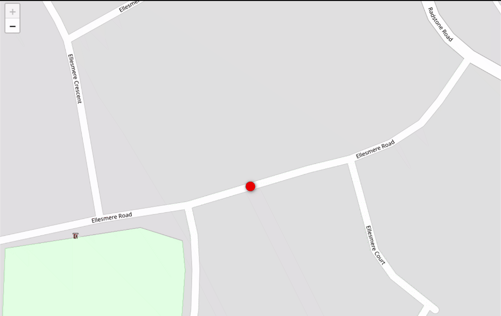

# Ably Asset Tracking JavaScript SDK Demo

This app uses the Ably Asset Tracking for JavaScript SDK to subscribe to updates from a publisher, such as the [Android Publishing Example App](https://ably.com/documentation/asset-tracking/example-apps#android).

It is offered as a simpler (and less feature-rich) alternative to the [example app bundled within the Ably Asset Tracking JavaScript SDK repo](https://github.com/ably/ably-asset-tracking-js/tree/main/examples/subscribing-example-app), because it uses the open-source [Leaflet.js](https://leafletjs.com/) web mapping library instead of the Google Maps API or Mapbox, and hence does not require an API key to use.

To run it:

1. Clone this repository
2. Change into the project directory and run `npm install` to install the required dependencies.
3. Run the [Android publishing example app](https://ably.com/documentation/asset-tracking/example-apps#android) and make a note of the tracking ID.
4. Copy `sample.env` to `.env` and configure your Ably API key and the tracking ID from the preceding step.
5. Open your browser at [http://localhost:5000](http://localhost:5000) and watch the asset being tracked in realtime.
